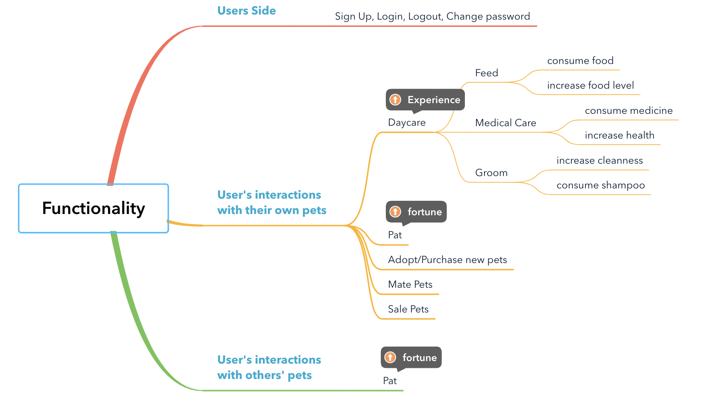
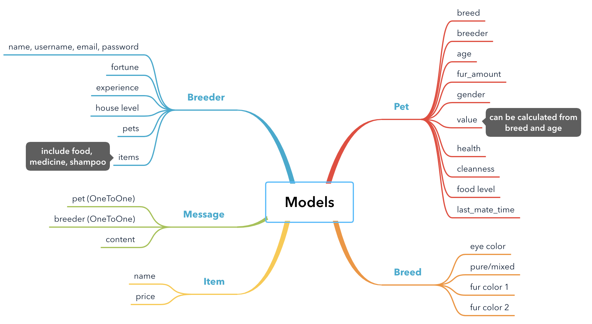
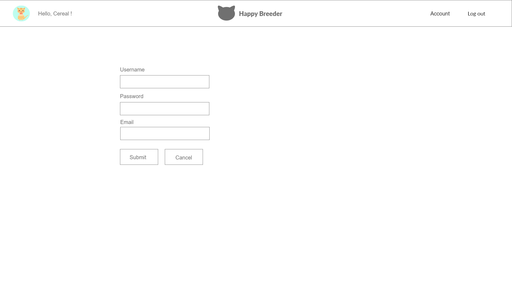
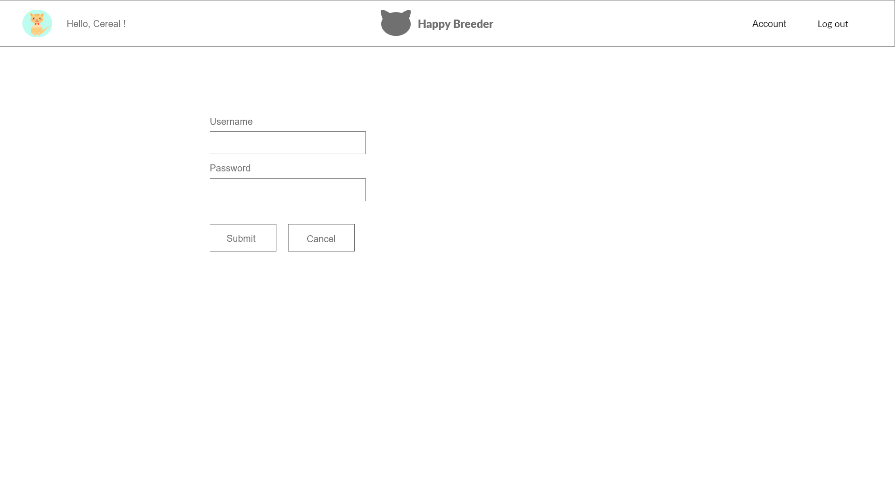
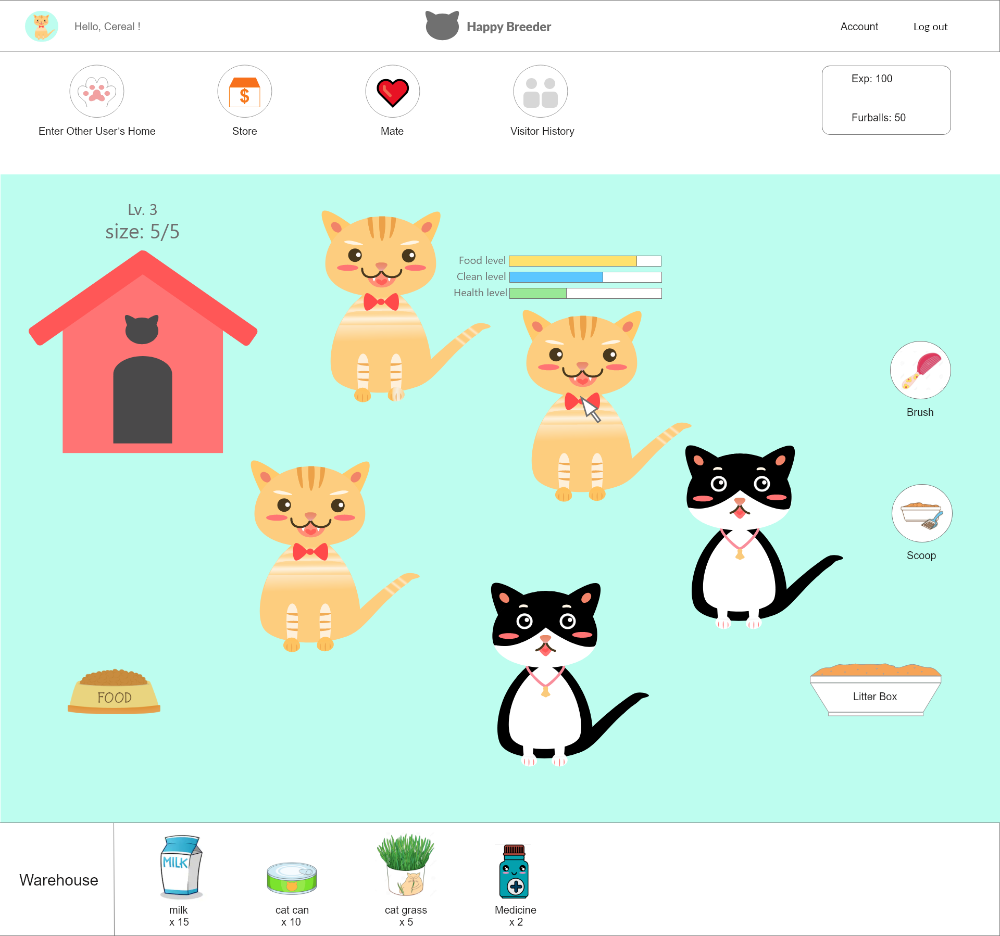
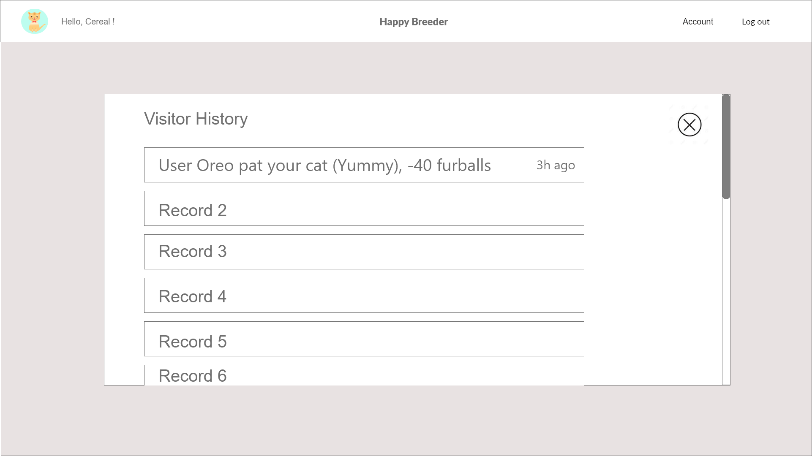
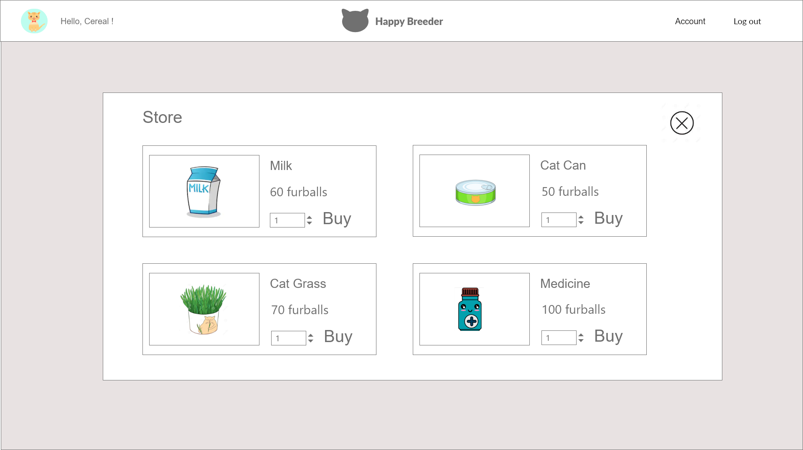
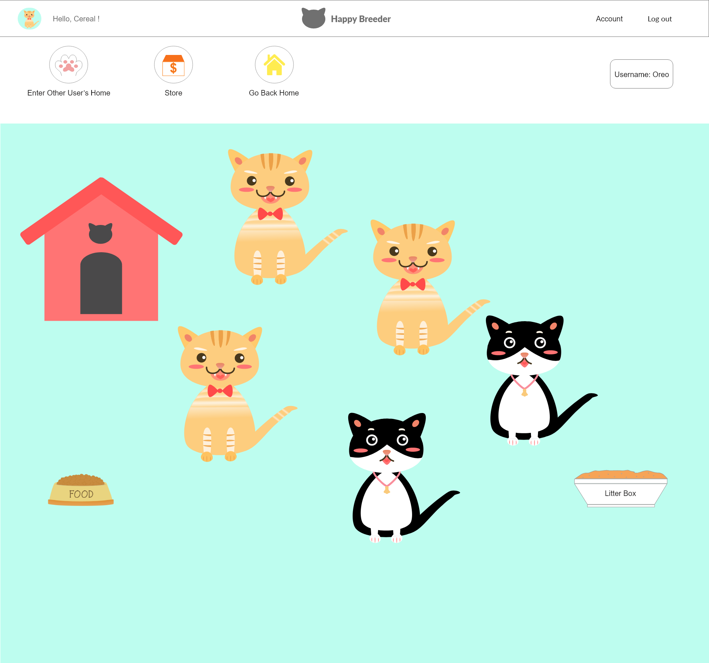

20191022-Project-Specifications

## Original Project Proposal (Submitted on 10/07)
#### Description:

* We are planning to build a web-based social simulation game. Breeders would play the role of breeders. They need to complete certain tasks to gain ‘fortune’ and ‘experience’. Their tasks include:
Daycare (feeding, grooming, medical care, etc.) ---- increase experience value.
Patting their cats or other breeders’ cats to gain furballs as fortune to buy more items in the store for a better daycare ---- increase fortune.
Breed kittens for selling in the store ---- increase fortune & experience.

* Leveling up cattery to have more capacity of cats. Leveling up costs fortune and experience. Purchasing food, and toys also cost money.

* Breeders can also interact with their friends by visiting each others’ kennels and pat their pets to gain extra currency. Cats have “patting” limits. Breeders can only pat a cat to certain times a day.


#### Technologies:

* Collie - Javascript animation library (http://jindo.dev.naver.com/collie/): based on HTML5 and javascript. We are going to use it for object movement, background changing, and scenario setup. Since we are going to implement abundant animations and user interactions, we need to use this external technology beyond what we learned from the class.
* Django: as an interaction backend database.


## Functionalities of Happy Breeder

#### SignUp, Login, Logout, Change Password
* Non-logged-in users may register for the site.
* Registering users must provide user name, first name, last name, and password.
* Registering for the site leaves the user logged in as the newly registered user.
* Registered users may log in using their username and password.
* Logged-in users are able to log out.
* User can change password.

#### Inside the Game - Breeder’s interactions with their own cats
* At the very beginning, breeders are allowed to adopt their own cats for free when register completed.
* Daycare own cats (e.g. feed, gloom or medical care with tools purchased in the store. )to gain experience. Experience can be used to level up the room, increasing the size of the room and the capacity to have more cats.
Pat own cats to gain fortune which can be used to purchase tools in store to increase related value.
* Track the patting history of their cats(see who pats their cats and stole the fur).
* For cats that are at least 1 year old, breeders can choose to mate them with another cat that is at least 1 year old (the last_mate_time of two cats have to be at least 3 days ago for them to be able to mate).

#### Inside the game - Breeder’s interactions with others’ cats
* Pat other cats to gain fortune which can be used to purchase tools in store to increase related value.
* Return to his/her own room.

#### Inside the game - Breeder’s purchase in the store
* Purchase food and toy using fortune in the store.
* Purchase kitten to refill your room.
* Sell your kittens or cats to gain fortune.
* Return your own room.
* Randomly enter other breeders’ room to collect fortune.

## Product Owner
* Week 1-2: Yinjie Gao,
* Week 3: Jie Lian,
* Week 4: Ruoqing Cheng,
* Week 5: Xinduo Chen


## Model Design

* The implementation of the model is in the: `final-project--happy-breeder/src/happy_breeder/happy_breeder_app/models.py`
* Code:

```python
from django.db import models
from django.contrib.auth.models import AbstractUser
from django.core.exceptions import ValidationError

# Create your models here.
def validate_color(value):
	if len(value) != 7 or value[0] != "#":
		raise ValidationError('%s is not an valid color' % value)
	for i in range(1, len(value)):
		if (ord(value[i]) >= 48 and ord(value[i]) <= 57):
			pass
		elif (ord(value[i]) >= 65 and ord(value[i]) <= 70):
			pass
		elif (ord(value[i]) >= 97 and ord(value[i]) <= 102):
			pass
		else:
			raise ValidationError('%s is not a valid color' % value)

def validate_age(value):
	if value < 0 or value >= 20:
		raise ValidationError('%s is not a valid age' % value)

def validate_with_in_100(value):
	if value < 0 or value >= 100:
		raise ValidationError('%s is not a valid value' % value)

class Breeder(AbstractUser):
	fortune = models.IntegerField(default = 0)
	experience = models.IntegerField(default = 0)
	house_level_choice = (
		(0, "start house"),
		(1, "advanced house"),
		(2, "super house"),
		(3, "noble house"),
		(4, "royal house"),
		)
	house_level = models.IntegerField(default = 0, choices = house_level_choice)

class Breed(models.Model):
	eye_color_choice = models.CharField(validator = validate_color)
	fur_color_1 = models.CharField(validator = validate_color)
	fur_color_2 = models.CharField(validator = validate_color)
	pattern_choice = (
		(0, "pure"),
		(1, "mix"),
		)
	pattern = models.IntegerField(choices = pattern_choice)

class Pet(models.Model):
	breed = models.ForeignKey(Breed, on_delete=models.CASCADE)
	breeder = models.ForeignKey(Breeder, on_delete=models.CASCADE)
	age = models.IntegerField(validator = validate_age)
	fur_amount = models.IntegerField(validator = validate_with_in_100)
	gender_choice = (
		(0, "male"),
		(1, "female"),
		)
	gender = models.IntegerField(choices = gender_choice)
	health_choice = (
		(0, "health"),
		(1, "sick")
		)
	cleanness = models.IntegerField(validator = validate_with_in_100)
	food_level = models.IntegerField(validator = validate_with_in_100)
	last_mate_time = models.TimeField()

class Message(models.Model):
	pet = models.OneToOneField(Pet, on_delete=models.CASCADE)
	breeder = models.OneToOneField(Breeder, on_delete=models.CASCADE)
	content = models.TextField()

class Item(models.Model):
	name = models.CharField(max_length = 50)
	price = models.IntegerField(validator = validate_with_in_100)
	breeder = models.ManyToManyField(Breeder, through = 'BreederItemThrough')

class BreederItemThrough(models.Model):
	breeder = models.ForeignKey(Breeder, on_delete=models.CASCADE)
	item = models.ForeignKey(Item, on_delete=models.CASCADE)
	amount = models.IntegerField(validator = validate_with_in_100)
```

## Timeline, Deadline & Task Assignment


## Wireframe Design



Pop-up page - messages (Click 'Visitor History'):

Pop-up page - store (Click 'Store'):


